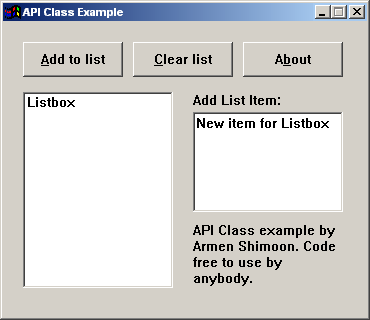



## Only API form and controls

### Description

A pretty advanced code to make a form and various controls on that form (listbox, edit, static, and buttons). Shows you how to capture the messages sent to controls (sub classing) and send messages to controls. Includes a tonne of API calls, types, and a whole bunch of constants. Hope you like it. If you find it useful please vote for it! Thanks Alot! -Armen Shimoon
 
### More Info
 

             |
---                |---
**Submitted On**   |2001-07-02 11:18:16
**By**             |[Armen Shimoon](https://github.com/Planet-Source-Code/PSCIndex/blob/master/ByAuthor/armen-shimoon.md)
**Level**          |Advanced
**User Rating**    |4.5 (45 globes from 10 users)
**Compatibility**  |VB 6\.0
**Category**       |[Windows API Call/ Explanation](https://github.com/Planet-Source-Code/PSCIndex/blob/master/ByCategory/windows-api-call-explanation__1-39.md)
**World**          |[Visual Basic](https://github.com/Planet-Source-Code/PSCIndex/blob/master/ByWorld/visual-basic.md)
**Archive File**   |[Only API f22071722001\.zip](https://github.com/Planet-Source-Code/armen-shimoon-only-api-form-and-controls__1-24640/archive/master.zip)

